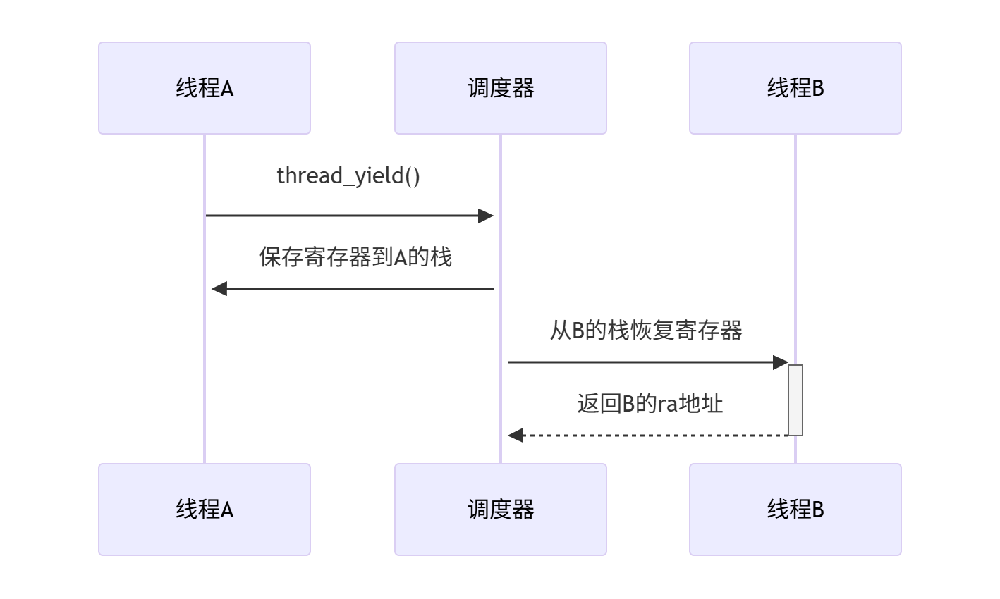
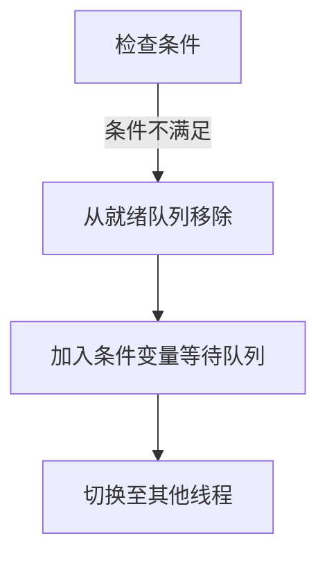
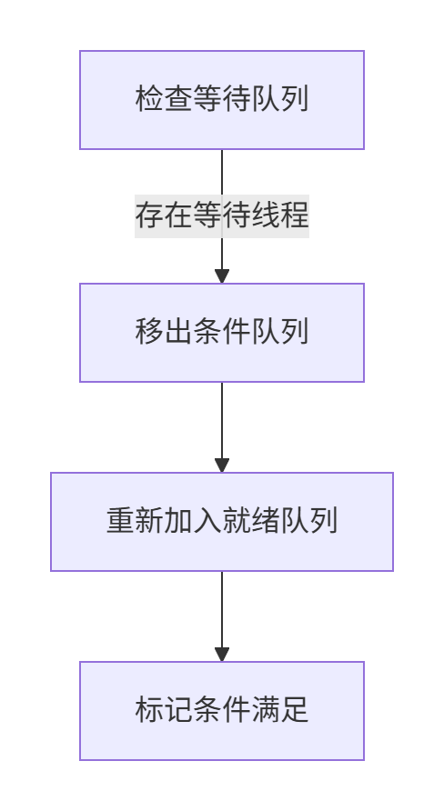
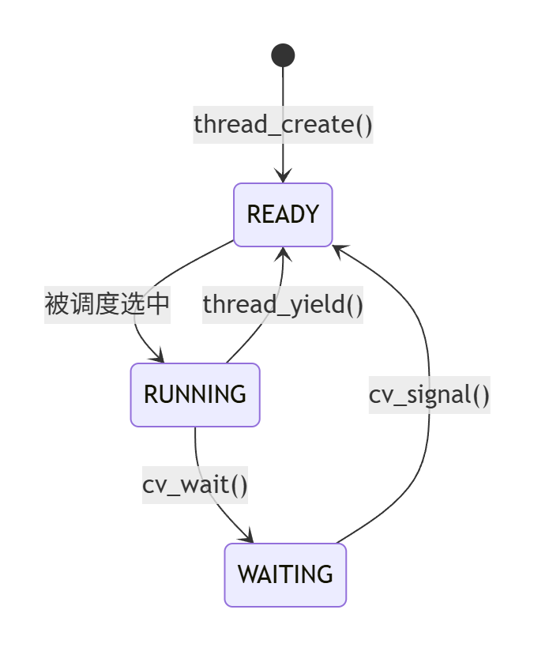

# 操作系统线程实现原理学习笔记

## 一、线程调度模型对比分析

### 1. 协作式线程模型 (Cooperative Threads)

#### 核心特征

-   **主动让出机制**：线程必须通过显式调用`thread_yield()`或执行阻塞操作来释放 CPU 控制权
-   **无强制调度**：系统不依赖时钟中断来强制进行线程切换

#### 优势特点

-   **实现简单**：由于不存在并发执行，无需处理复杂的原子操作和锁机制
-   **高效切换**：上下文切换的开销显著降低，适合轻量级任务

#### 局限性

-   **系统脆弱性**：单个线程的崩溃或死循环会导致整个系统阻塞
-   **适用场景受限**：不适合处理 CPU 密集型任务，难以保证公平性

### 2. 抢占式线程模型 (Preemptive Threads)

#### 核心特征

-   **强制调度机制**：通过系统时钟中断定期触发线程调度器
-   **透明切换**：线程无需关心 CPU 资源的释放，由系统强制管理

#### 优势特点

-   **公平调度**：有效防止单个线程长时间独占 CPU 资源
-   **系统健壮性**：单个线程的故障不会影响其他线程的正常执行

#### 实现挑战

-   **并发控制**：必须处理竞态条件和同步问题
-   **性能开销**：上下文切换和中断处理带来额外性能消耗

## 二、调度模型对比分析表

| 对比维度       | 协作式线程模型           | 抢占式线程模型       |
| -------------- | ------------------------ | -------------------- |
| **触发方式**   | 显式调用 yield()         | 时钟中断强制触发     |
| **响应实时性** | 不可预测                 | 可保证最大延迟       |
| **实现复杂度** | 低（无并发竞争）         | 高（需处理竞态条件） |
| **典型应用**   | 嵌入式实时系统           | 通用操作系统         |
| **系统健壮性** | 较低（单点故障影响全局） | 较高（故障隔离）     |
| **性能开销**   | 切换开销小               | 切换开销较大         |

## 三、实现选择建议

在实际操作系统开发中，模型选择需要综合考虑：

1. **实时性要求**：对响应时间敏感的嵌入式系统可能更适合协作式
2. **系统复杂度**：抢占式虽然功能强大但实现难度显著增加
3. **硬件支持**：RISC-V 架构需要特别注意寄存器保存规范和原子操作支持

# EGOS 协作式线程实现原理详解

## 一、线程创建原理

### 1. 核心概念

线程创建的本质是构建一个**独立的执行上下文**，需要完成：

1. **执行环境准备**：分配独立的栈空间
2. **控制结构初始化**：创建 TCB（线程控制块）
3. **执行流设置**：初始化程序计数器和栈帧

### 2. 关键技术点

-   **栈空间分配**：
    -   每个线程需要独立的栈空间（通常 1-8MB）
    -   栈增长方向：RISC-V 采用递减栈（高地址 → 低地址）
-   **上下文初始化**：

    ```c
      // 对应thread_create()实现
      void thread_create(...) {
          thread_t child_t = malloc(sizeof(struct thread)); // 1. 创建TCB
          child_t->init_sp = malloc(stack_size);           // 2. 分配栈空间
          child_t->sp = (char*)child_t->init_sp + stack_size; // 3. 栈顶对齐

          child_t->fun = entry;  // 4. 设置入口函数
          child_t->args = arg;   // 5. 绑定参数
          // 注：实际栈帧初始化在ctx_start中完成
      }
    ```

二、上下文切换原理

上下文切换需要完成：

1. **执行现场保存**
    - 将当前线程的所有寄存器状态保存到其栈中
    - 参考实现：`context.s`中的`SAVE_ALL_REGISTERS`宏
    ```asm
    .macro SAVE_ALL_REGISTERS
        sw ra, 0(sp)    # 保存返回地址
        sw s0, 4(sp)    # 保存被调用者寄存器
        ...
        sw sp, 120(sp)  # 保存当前栈指针
    .endm
    ```
2. **​​ 调度决策 ​​**
   采用 FIFO 队列实现简单公平调度
    ```
     // 调度器伪代码
     next_thread = dequeue(ready_queue);
    ```
3. **​​ 执行现场恢复 ​​**
   从新线程的栈中恢复所有寄存器状态
   参考实现：context.s 中的 RESTORE_ALL_REGISTERS 宏
    ```asm
     .macro RESTORE_ALL_REGISTERS
         lw ra, 0(sp)    # 恢复返回地址
         lw s0, 4(sp)    # 恢复被调用者寄存器
         ...
         lw sp, 120(sp)  # 恢复栈指针
     .endm
    ```
    下面是协作式线程切换的原理图：
    

## 一、条件变量核心原理

### 1. 等待机制原理

当线程调用`cv_wait()`时，系统需要完成以下原子操作：



## 关键步骤说明：

1. ​​ 解除调度绑定 ​​
   将当前线程从全局就绪队列(tcb_queue)中移除
   确保该线程不再被调度器选中执行
2. 加入等待队列 ​​
   将线程 TCB 插入条件变量的专属等待队列(condition->tcb_queue)
   线程状态变更为 WAITING（需自行扩展状态枚举）
3. ​ 触发上下文切换 ​​
   主动调用 ctx_switch 让出 CPU
   切换目标为调度器选择的新线程

## 唤醒机制原理

当 cv_signal()被调用时，系统执行反向操作，如图所示：


## 整体状态转换如图所示：



> 注：本学习笔记基于对 EGOS 操作系统的研究实践，重点记录了 RISC-V 架构下的线程实现原理理解过程。具体实现细节请参考代码。
