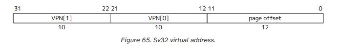
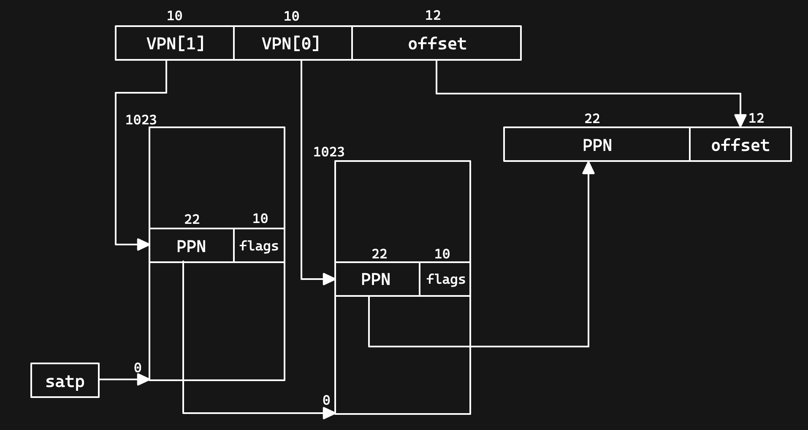
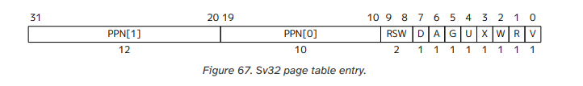

📢 [Feb 3, 2025] The first draft of the [EGOS book](https://egos.fun/book/overview.html) has been released which contains 9 course projects.

本分支针对 EGOS 中的第 P4 节的虚拟内存的原理以及代码实现

# 一、虚拟内存的本质

虚拟内存是现代计算机系统中的关键抽象层，它通过软硬件协同工作，为每个程序创造一个独立且连续的"虚拟地址空间"。这个空间与实际的物理内存分离，由内存管理单元（MMU）负责动态映射。

# 二、为什么需要虚拟内存？

## 内存隔离与安全保障

-   **问题本质**：在直接使用物理内存的环境中，程序可能意外覆盖其他程序的数据，或恶意读取敏感信息。

-   **解决方案**：虚拟内存为每个进程提供独立的地址空间，使它们仿佛独占整个内存。通过页表机制，操作系统可以精确控制每个内存区域的访问权限（读/写/执行）。

## 突破物理内存容量限制

-   **现实矛盾**：物理内存容量有限，而现代应用程序往往需要更大的内存空间。

-   **创新方案**：利用磁盘空间作为扩展，将不活跃的内存页面暂时存储到硬盘（交换空间）。当程序再次访问这些页面时，系统会自动将其换回内存，这个过程对应用程序完全透明。

## 简化编程与内存管理

-   **开发困境**：直接管理物理内存需要考虑碎片化、地址冲突等复杂问题。

-   **解决之道**：虚拟内存让程序员看到的是连续、统一的内存空间，底层物理内存的分配和管理由操作系统自动处理。这使得内存分配（如 malloc）变得简单可靠。

## 高效共享系统资源

-   **性能需求**：系统库（如 libc）需要被多个进程共享，但又要保证安全性。

-   **实现方式**：通过虚拟内存机制，可以将同一物理内存映射到不同进程的地址空间，同时设置只读权限，既节省内存又确保安全。

# 三、核心工作原理

## 地址转换机制

当 CPU 发出内存访问指令时，虚拟地址首先被拆分为虚拟页号（VPN）和页内偏移量。MMU 通过查询页表，将虚拟页号转换为物理页号（PPN），再与偏移量组合成物理地址。这个转换过程对应用程序完全透明，由硬件自动完成。

## 页表的核心作用

页表是存储在内存中的数据结构，记录虚拟页到物理页的映射关系。每个页表项不仅包含地址映射信息，还包括访问权限、页面属性等重要控制位。

## 缺页异常处理

当访问的页面不在物理内存时，硬件会触发缺页异常。操作系统接管后，会从磁盘加载所需页面，更新页表，然后恢复程序执行。这个过程保证了程序可以"透明地"使用比物理内存更大的地址空间。

# 实现 EGOS 的虚拟内存细节

虚拟内存的地址结构分为三个部分：VPN[1]、VPN[2] 以及页面偏移（page offset）。这一结构确保了高效的内存管理和访问。如下所示：



## 虚拟地址转换过程

虚拟地址的转换过程是实现虚拟内存的关键。该过程涉及将虚拟地址映射到物理地址，并通过页表进行管理。转换过程如下图所示：



理解了上述过程后，接下来需要按照芯片手册配置相应的寄存器。

## Sv32 二级页表

Sv32 使用二级页表，每个页表包含 \(2^{10} = 1024\) 个页表项（PTE），每个页表项占用 4 个字节。因此，一个页表的大小正好为 4KiB，且必须页对齐。每个页表项的结构如下所示：



### 页表项字段说明

-   **RSW**：保留位，必须设置为 0。
-   **A（Accessed）**：指示页表项是否被访问过。若为 1，则表明该页已被读取或执行。
-   **D（Dirty）**：指示页表项是否被写过。若为 1，则表明该页的内容已被修改。
-   **G（Global）**：全局位，若设置为 1，则该页表项不会被 TLB（Translation Lookaside Buffer）清除，适用于多进程共享的内存页。
-   **U（User）**：用户位，若设置为 1，则允许用户态访问该页，适用于用户程序和操作系统的交互。
-   **X（eXecute）、W（Write）、R（Read）**：可执行、可写、可读位。若 RWX 全部为 0，则表示当前页表项指向下一级页表。在编写代码时需要特别注意这一点。

```C
//代码中需要将根页表的RWX位设置为0，表示指向下一级页表
root_page[vpn1] = (paddr >> 2) |  0x1;
```

W 为 1，R 一定也为 1（W 为 1、R 为 0 是保留状态）
V（Valid）：有效位，如果为 1 则表示该页表项有效，否则在访问时会触发异常

由于采用了分页管理方式，RISC-V 还提供了 PMP（Physical Memory Protection）内存管理设置。我们需要确保所有物理地址均开放权限，以避免因访问权限不足导致的地址转换失败。以下是配置代码：

```C
    /* Setup a PMP region for the whole 4GB address space
        此处设置所有物理内存可以访问，因为如果页表处的物理内存不能访问的话，mmu无法完成地址转换
        mmu转换地址的时候的特权级，与cpu的当前特权级有关，也就是在用户模式下，mmu相当于也只有用户特权级
        INFO("app addrs space: 1GB");
    */
    asm("csrw pmpaddr0, %0" : : "r"(0x40000000));
    asm("csrw pmpcfg0, %0" : : "r"(0xF));
```

-   在配置 PMP 时，pmpaddr0 和 pmpcfg0 的设置确保了整个地址空间的可访问性。这对于运行多种应用程序至关重要，尤其是在多任务环境中。PMP 的配置允许操作系统在保护和性能之间取得平衡。
-   通过适当的权限设置，可以防止未授权访问，从而提高系统的安全性，确保敏感数据不被非法访问。
-   在调试和开发过程中，确保有效位的正确设置可以帮助快速定位问题，减少因访问错误引起的异常。调试工具可以利用访问位和脏位信息来跟踪内存使用情况。
